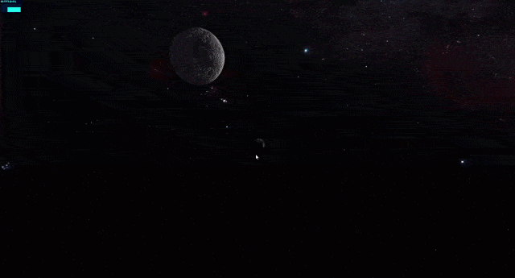

# The Earth 🌎🌍🌏

> The Earth in the space in the 3D scene ✨

### See the <a href='https://dnt-knw.github.io/The-Earth' target='_blank' title='Click to open the project'>Demo</a> 👁

## Description 📖

### You can find here 🔍

- The Earth 🌍 and the clouds ☁️ moving on it
- The moving Moon 🌕
- The brightly glowing sun ☀️
- Awesome space background 🌟
 
 ## Usage ⌨️
 
<ul>
    <li>Hold down left mouse button 🖱 to rotate this scene on PC 🖥 / Laptop 💻  </li>
    <li>Use mouse wheel 🖱 to change distance to this scene on PC 🖥 / Laptop 💻  </li>
    <li>Use 1 finger 👆 to rotate this scene on mobile 📱  </li>
    <li>Use 2 fingers ✌️ to bring closer / move away from this scene on mobile 📱  </li>
</ul>
